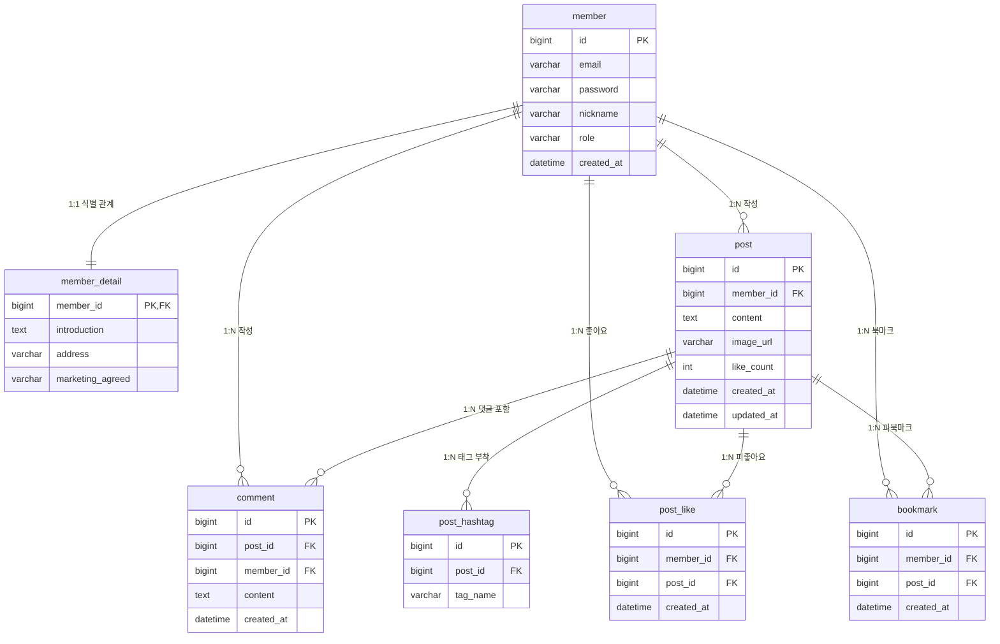

# 6. 스프링 부트 Data JPA 1 - 핵심 원리와 영속성 컨텍스트

## 학습 목표
- 관계형 데이터베이스와 객체지향 패러다임 불일치를 이해하고 JPA 및 하이버네이트의 표준 동작 구조를 습득함.
- Spring Boot Data JPA 환경을 구축하고 애플리케이션 실행 시 하이버네이트 DDL 자동 생성을 확인함.
- SNS 도메인의 핵심 테이블을 기본 엔티티로 매핑하고 리포지토리 및 단위 테스트를 구현함.
- 영속성 컨텍스트의 4대 핵심 기능(1차 캐시, 동일성 보장, 쓰기 지연, 변경 감지)과 엔티티 4가지 생명주기 상태 전이를 완벽히 이해하고 검증함.

---

## 목차
- [1. JPA 핵심 원리와 개발 환경 구축](#1-jpa-핵심-원리와-개발-환경-구축)
  - [1.1 JPA 도입 배경](#11-jpa-도입-배경)
  - [1.2 Spring Boot Data JPA 환경 구축과 설정](#12-spring-boot-data-jpa-환경-구축과-설정)
- [2. SNS 도메인 엔티티 매핑](#2-sns-도메인-엔티티-매핑)
  - [2.1 SNS 도메인 ERD](#21-sns-도메인-erd)
  - [2.2 핵심 엔티티 작성 (Member, Post)](#22-핵심-엔티티-작성-member-post)
  - [2.3 Member, Post 테스트 케이스 작성](#23-member-post-테스트-케이스-작성)
  - [2.4 엔티티 매핑 핵심 어노테이션과 속성](#24-엔티티-매핑-핵심-어노테이션과-속성)
  - [2.5 도메인 엔티티 구현 실습](#25-도메인-엔티티-구현-실습)
  - [2.6 애플리케이션 실행 및 DDL 생성 확인](#26-애플리케이션-실행-및-ddl-생성-확인)
- [3. 영속성 컨텍스트와 엔티티 생명주기](#3-영속성-컨텍스트와-엔티티-생명주기)
  - [3.1 영속성 컨텍스트의 정의와 관리 구조](#31-영속성-컨텍스트의-정의와-관리-구조)
  - [3.2 엔티티 4가지 생명주기 상태](#32-엔티티-4가지-생명주기-상태)
  - [3.3 상태 전이 핵심 API 동작](#33-상태-전이-핵심-api-동작)
  - [3.4 영속성 컨텍스트 4대 핵심 기능](#34-영속성-컨텍스트-4대-핵심-기능)
  - [3.5 영속성 컨텍스트 핵심 메커니즘 테스트 케이스 작성](#35-영속성-컨텍스트-핵심-메커니즘-테스트-케이스-작성)

---

# 1. JPA 핵심 원리와 개발 환경 구축

## 1.1 JPA 도입 배경
- 기존 데이터 접근 기술의 발전과 한계
  - 순수 JDBC: 데이터베이스 연결부터 쿼리 실행, 자원 해제까지 수많은 보일러플레이트 코드를 직접 작성해야 하고 SQL이 자바 코드 내에 하드코딩되는 문제가 발생함.
  - JdbcTemplate: 반복적인 자원 관리와 예외 처리는 프레임워크가 자동화했으나, 여전히 자바 코드 안에 SQL 문자열이 혼재되어 가독성이 떨어지고 쿼리 결과를 객체로 매핑하는 코드를 수작업으로 작성해야 함.
  - MyBatis: SQL 문을 XML 파일로 분리하여 자바 코드와 격리하는 데는 성공했으나, 테이블 컬럼이 하나만 추가되거나 수정되어도 관련된 모든 CRUD(등록, 수정, 삭제, 조회) SQL과 DTO 매핑을 개발자가 일일이 수작업으로 변경해야 함.
  - 공통적인 한계: 애플리케이션의 핵심인 비즈니스 로직 개발보다 테이블 구조에 맞춘 SQL 쿼리를 작성하고 유지보수하는 데 대부분의 개발 리소스가 소모됨.
- 객체와 테이블의 일체화를 통한 쿼리 자동 생성
  - 자바 객체와 데이터베이스 테이블을 1:1로 일체화(매핑)시켜 둘 수 있다면, 기본적인 등록(INSERT), 수정(UPDATE), 삭제(DELETE), 단건 조회(SELECT) 쿼리는 프레임워크가 객체 정보를 기반으로 스스로 생성해 줄 수 있음.
  - 개발자가 직접 SQL 문을 작성하는 대신 자바 코드로 객체 상태를 조작하면, 프레임워크가 테이블 구조에 맞는 쿼리를 동적으로 완성하여 데이터베이스와 통신을 처리함.
  - 이러한 객체와 테이블의 일체화를 표준화하여 개발자가 객체 중심의 도메인 설계에 전념할 수 있도록 지원하는 핵심 기술이 ORM과 JPA에 해당함.

### 1.1.1 ORM의 매핑 원리와 JPA 및 하이버네이트의 역할
#### 1) ORM의 매핑 원리
- ORM (Object-Relational Mapping)은 객체지향 프로그래밍의 객체 구조와 관계형 데이터베이스의 테이블 구조 간의 차이를 중간에서 자동으로 연결하여 해결하는 매핑 기술.
- 객체는 객체지향 원칙에 따라 설계하고 데이터베이스는 관계형 모델에 맞추어 설계한 뒤, 둘 사이의 매핑 설정을 기반으로 프레임워크가 SQL을 동적으로 자동 생성하여 영속화 [^1]를 대행함.
- 개발자는 반복적인 CRUD SQL 작성에서 벗어나 도메인의 비즈니스 로직에 집중할 수 있음.

#### 2) JPA 표준 명세 인터페이스
- JPA (Java Persistence API)는 자바 플랫폼에서 ORM 기술을 사용하기 위한 표준 인터페이스 규약의 모음.
- 특정 구현 기술에 종속되지 않도록 인터페이스 형태로 정의되어 있으며, 데이터 접근 계층의 표준화를 지원함.
- 개발자는 JPA 표준 인터페이스(EntityManager 등)를 기반으로 코드를 작성함.

#### 3) 하이버네이트 구현체
- 하이버네이트 (Hibernate)는 JPA 표준 인터페이스 명세를 실제로 구현한 대표적인 오픈소스 ORM 프레임워크.
- JPA가 추상화된 표준 설계도(인터페이스)라면, 하이버네이트는 해당 설계도에 따라 실제로 데이터베이스와 통신하고 쿼리를 생성하는 구체적인 엔진(구현체)에 해당함.
- 개발자가 작성한 객체 조작 명령을 해석하여 대상 데이터베이스의 독자적인 문법에 최적화된 SQL을 생성하고 실행을 담당함.

### 1.1.2 객체와 관계형 데이터베이스의 패러다임 불일치와 JPA의 해결 방안
관계형 데이터베이스 (RDB)는 데이터를 정규화된 테이블 구조로 저장하고 관리하는 데 집중하며, 객체지향 프로그래밍 언어는 상태와 행위를 캡슐화한 객체 중심의 설계를 지향함. 서로 다른 철학에서 비롯되는 이러한 구조적 차이를 패러다임 불일치라고 부르며, 상속, 연관관계, 객체 탐색 방식에서 대표적인 충돌이 발생함. JPA는 이러한 패러다임 불일치를 극복하고 객체 중심 설계를 유지할 수 있도록 지원함.

#### 1) 상속 구조의 불일치
- 객체의 상속 구조를 RDB에 영속화해야 하는 이유
  - 비즈니스 요구사항을 객체지향적으로 모델링할 때, 공통 속성과 개별 속성을 분리하고 다형성을 활용하기 위해 클래스 상속을 자연스럽게 사용함.
  - 예를 들어 SNS 서비스에서 회원(Member: id, email, password, created_at 등)을 부모 클래스로 두고, 일반 사용자(User: nickname, profile_image 등)와 관리자(Admin: department, security_level 등)를 자식 클래스로 상속 설계하는 경우를 들 수 있음.
  - 애플리케이션 메모리에서 생성된 객체의 데이터는 시스템이 재시작되더라도 유지되어야 하므로, 영구 데이터 저장소인 데이터베이스에 저장해야 함.
  - 따라서 메모리상의 객체 상속 데이터를 RDB 테이블 구조로 변환하여 보관해야 하는 과제가 발생함.
- 상속 지원 부재와 슈퍼타입-서브타입 모델 차용
  - 객체지향 언어는 상속과 다형성을 언어 차원에서 기본 문법으로 지원함.
  - 반면 관계형 데이터베이스는 테이블 간의 상속이라는 문법과 기능이 지원되지 않음.
  - 결국 RDB 환경에서 객체의 상속 데이터를 담아내기 위해, 데이터 모델링 이론 중 상속과 구조적으로 가장 유사한 슈퍼타입-서브타입 관계 모델(예: member 슈퍼타입 테이블과 user, admin 서브타입 테이블)을 대안으로 차용하여 테이블을 설계하게 됨.
- 개발자가 마주하는 SQL 변환 부담
  - 자바에서는 단순히 부모 클래스를 상속받아 Admin 객체를 생성하면 되지만, 데이터베이스에 저장할 때는 슈퍼타입(member)과 서브타입(admin) 테이블에 각각 INSERT SQL을 2번씩 나누어 작성해야 함.
  - 데이터를 조회할 때도 매번 두 테이블을 JOIN하는 복잡한 쿼리를 작성하고 결과를 자바 객체로 재조립해야 하는 번거로움이 발생함.
  - 이러한 패러다임 불일치로 인해 개발자는 점차 객체지향 설계를 포기하고, member 테이블 하나에 role 컬럼을 두고 관리자 전용 컬럼(department, security_level)을 모두 NULL 허용으로 몰아넣는 단순 평면 구조의 테이블과 객체만 설계하게 됨.
- JPA의 상속 매핑 해결 방안
  - 개발자가 자바 컬렉션에 객체를 다루듯이 엔티티를 영속화하면, JPA가 상속 매핑 설정을 기반으로 `member`와 `admin` 테이블에 필요한 INSERT 및 JOIN SELECT SQL을 동적으로 자동 생성하여 객체지향 다형성을 온전히 보장함.

#### 2) 연관관계 표현 방식
- 객체의 연관관계와 단방향 참조
  - 객체지향 프로그래밍에서 한 객체가 다른 객체와 연관관계를 맺으려면, 상대방 객체의 인스턴스 주소를 보관하는 참조(Reference) 변수를 필드로 선언해야 함.
  - 예를 들어 SNS 서비스에서 게시글(Post)이 작성자 회원(Member) 정보를 알고자 할 때, 게시글 클래스 내부에 `private Member member;` 형태의 참조 변수를 정의함.
  - 이 참조는 출발지 객체에서 목적지 객체로만 향하는 단방향 특성을 지니므로, `post.getMember()`를 통한 탐색은 가능하지만 반대로 Member 객체에서 자신이 작성한 게시글을 거꾸로 탐색할 수는 없음.
  - 객체 세상에서 양방향 탐색을 구현하려면 양쪽 클래스 모두에 서로를 가리키는 단방향 참조 변수(Post의 `member`, Member의 `List<Post> posts`)를 각각 선언하여 2개의 단방향을 인위적으로 연결해야 함.
- 관계형 데이터베이스의 외래 키 연관관계
  - RDB는 참조 변수라는 문법이 없으며, 테이블 간의 연관관계를 오직 외래 키 (FK) 컬럼 하나로만 정의함.
  - 게시글 테이블에 `member_id` 외래 키 컬럼 하나만 존재하면, 게시글 기준 조인이든 회원 기준 조인이든 상관없이 방향성 없는 양방향 조회가 가능함.
- 패러다임 불일치로 인한 객체 모델의 왜곡
  - 객체지향 설계 관점에서는 게시글이 회원의 참조 변수(`Member member`)를 직접 가지고 있어야 점(.) 연산자로 자유롭게 객체를 탐색할 수 있음.
  - 하지만 SQL 중심 개발 환경에서는 데이터베이스 외래 키 구조에 맞추기 위해 `Long memberId`와 같은 단순 식별자 숫자 값을 게시글 객체에 보관하는 왜곡이 발생함.
  - 결국 객체지향의 장점인 객체 간 협력과 참조 탐색이 어려워지고, 객체가 단순한 데이터 전달용 바구니(데이터 홀더)로 전락하게 됨.
- JPA의 연관관계 매핑 해결 방안
  - 개발자는 객체 세상에서 참조 변수(`post.setMember(member)`)를 그대로 사용하고, JPA는 연관관계 매핑 설정을 바탕으로 데이터베이스 외래 키(`member_id`)를 추출하여 SQL에 바인딩함으로써 객체 모델 왜곡 없이 참조와 외래 키를 자동으로 연결함.

#### 3) 객체 그래프 탐색과 동일성의 한계
- 객체 그래프 탐색의 제한
  - 객체 세상에서는 점(.) 연산자를 통해 연결된 다른 객체를 자유롭게 타고 들어갈 수 있어야 함(예: `post.getMember().getNickname()`).
  - 하지만 SQL 매퍼 라이브러리 환경에서는 처음에 실행한 SQL이 작성자(Member) 테이블을 조인해서 함께 조회해오지 않았다면, `post.getMember()`를 호출했을 때 `null`이 반환되어 `NullPointerException`이 발생함.
  - 결국 서비스 계층의 비즈니스 로직은 DAO의 SQL이 실제로 어떤 테이블까지 JOIN해서 채워주었는지 직접 코드를 확인하기 전에는 객체를 마음 놓고 탐색할 수 없음.
  - 이로 인해 화면 요구사항에 맞추어 `selectPost()`, `selectPostWithMember()`, `selectPostWithComments()`처럼 탐색 깊이마다 전용 조회 메서드를 따로따로 계속해서 만들어야 하는 문제가 발생함.
- 객체 동일성 불일치
  - 데이터베이스의 동일한 행(Row)을 두 번 조회하더라도, 매번 `new` 키워드로 새로운 자바 인스턴스가 생성되어 반환되므로 동등 연산자(`==`) 비교 시 서로 다른 객체로 판정되는 문제가 발생함.
- JPA의 탐색 및 동일성 보장 해결 방안
  - 연관된 엔티티가 실제로 필요한 시점까지 조회를 미루는 지연 로딩(Lazy Loading) 메커니즘을 지원하여, 최초 조회 시점이 아니더라도 점(.) 연산자를 통해 객체 그래프를 제약 없이 탐색하도록 지원함.
  - 동일한 트랜잭션 범위 내에서는 동일한 식별자(PK)로 조회한 엔티티의 1차 캐시 인스턴스 주소를 재사용하므로, 자바의 동등 연산자(`==`) 동일성 비교를 보장함.

## 1.2 Spring Boot Data JPA 환경 구축과 설정

### 1.2.1 Spring Boot 프로젝트 생성
#### 1) 새 프로젝트 시작
- IntelliJ IDEA > File > New > Project...

#### 2) Spring Boot 선택
- 생성창 좌측의 Generators 목록 중에서 Spring Boot 선택

#### 3) 프로젝트 기본 정보 입력
- Name: `jpa-sns`
- Location(프로젝트를 생성할 폴더 선택): `c:/bebc25/springboot-yong`(예시)
- Language: Java
- Type: Gradle - Groovy
- Group: `net.likelion.bebc25`
- Artifact: `jpa-sns`
- Package name: `net.likelion.bebc25.jpasns`
- JDK(컴파일러/런타임): 25 Eclipse Temurin
- Java(코드내의 Java 문법 버전): 25
- Packaging: Jar
- Configuration: YAML
- Next 클릭

#### 4) 스프링 부트 버전 및 의존성 라이브러리 선택
- Spring Boot: 4.1.1
- Dependencies
  - Developer Tools > `Lombok`: 자바 보일러플레이트 코드 자동화
  - Web > `Spring Web`: RESTful 웹 서비스 및 컨트롤러 아키텍처 지원
  - SQL > `Spring Data JPA`: 하이버네이트 기반 ORM 영속성 관리 및 공통 리포지토리 인터페이스 지원
  - SQL > `MySQL Driver`: MySQL 데이터베이스 연동 드라이버
- Create 버튼 클릭

#### 5) build.gradle 설정 추가
```groovy
tasks.named('test') {
    useJUnitPlatform()
    // Mockito 동적 에이전트 및 CDS 공유 경고 비활성화
    jvmArgs('-XX:+EnableDynamicAgentLoading', '-Xshare:off')
}
```

#### 6) application.yaml 설정 (src/main/resources/application.yaml)
```yaml
spring:
  application:
    name: jpa-sns
  # 데이터베이스 접속 정보
  datasource:
    driver-class-name: com.mysql.cj.jdbc.Driver
    url: 'jdbc:mysql://localhost:3306/jpa_db?serverTimezone=UTC&useSSL=false&allowPublicKeyRetrieval=true'
    username: jpa-app
    password: 'Jpa1234!'

  # JPA 및 하이버네이트 설정
  jpa:
    hibernate:
      ddl-auto: create
    properties:
      hibernate:
        show_sql: true
        format_sql: true
        use_sql_comments: true
```

### 1.2.2 JPA 실행 옵션과 성능 설정
- ddl-auto 옵션의 종류와 동작 방식
  - `none`: DDL 자동 생성 기능을 완전히 비활성화함. 데이터베이스 구조를 변경하지 않음.
  - `create`: 애플리케이션 시작 시점에 기존 테이블을 삭제(DROP)하고 엔티티 매핑 정보를 바탕으로 새로 생성(CREATE)함. 기존 데이터가 완전히 유실됨.
  - `create-drop`: create와 동일하게 시작 시 새로 생성하며, 애플리케이션 종료 시점에 생성된 테이블을 삭제(DROP)함. 주로 단위 테스트 환경에서 활용함.
  - `update`: 데이터베이스의 기존 테이블 구조와 엔티티 필드를 비교하여 변경되거나 추가된 컬럼만 반영(ALTER)함. 기존 데이터는 보존되지만, 엔티티에서 필드를 삭제하더라도 실제 DB 컬럼은 삭제되지 않고 유지됨.
  - `validate`: 테이블을 생성하거나 수정하지 않고, 엔티티 매핑 정보와 실제 데이터베이스 테이블 구조가 일치하는지만 검증함. 차이가 발생하면 애플리케이션 기동에 실패함.

- 스프링 부트의 기본 ddl-auto 판정 메커니즘
  - 내장 메모리 DB(H2 등): ddl-auto 설정을 명시하지 않으면 기본적으로 `create-drop`이 적용됨.
  - 외부 DB(MySQL, PostgreSQL 등): ddl-auto 설정을 명시하지 않으면 기본적으로 `none`이 적용됨.

- 환경별(프로파일) ddl-auto 설정 원칙
  - 로컬 및 개발 환경: 빠른 프로토타입 구현 및 매핑 검증을 위해 `update` 사용 허용
  - 테스트 환경: 격리된 단위 테스트 실행을 위해 H2 메모리 DB 기반 `create-drop` 활용
  - 실무 운영 환경: 대량 데이터 유실 및 테이블 락(Lock) 장애를 원천 차단하기 위해 개발자가 운영 프로파일(application-prod.yaml)에 직접 `none` 또는 `validate`로 설정하여 관리해야 함. 실무 운영 DB의 스키마 변경은 JPA의 자동 DDL이 아닌 SQL 스크립트를 통해 직접 수행함.

- 하이버네이트 로깅 및 디버깅 옵션
  - `show_sql`: 하이버네이트가 실행하는 SQL을 콘솔에 출력하도록 지정함. 로컬 개발 단계에서 생성 쿼리를 확인하고자 할 때 활용함.
  - `format_sql`: 한 줄로 길게 출력되는 SQL 문장을 들여쓰기와 줄바꿈이 적용된 정렬 형태로 변환하여 출력함으로써 쿼리 가독성을 높여줌.
  - `use_sql_comments`: 실행되는 SQL 상단에 대상 엔티티 조작이나 원본 JPQL 등의 실행 원인을 주석(`/* ... */`)으로 함께 표기하여 디버깅 추적을 지원함.

### 1.2.3 database 생성
```sql
-- 1. jpa_db 데이터베이스 생성
DROP DATABASE IF EXISTS `jpa_db`;
CREATE DATABASE IF NOT EXISTS `jpa_db`
  DEFAULT CHARACTER SET utf8mb4
  DEFAULT COLLATE utf8mb4_unicode_ci;

-- 2. 사용자 계정 생성
DROP USER IF EXISTS 'jpa-app';
CREATE USER IF NOT EXISTS 'jpa-app'@'%' IDENTIFIED BY 'Jpa1234!';

-- 3. jpa_db에 대한 모든 권한 부여
GRANT ALL PRIVILEGES ON `jpa_db`.* TO 'jpa-app'@'%';

```

---

# 2. SNS 도메인 엔티티 매핑
- 엔티티(Entity)의 정의 및 특징
  - 데이터베이스 테이블과 직접 매핑되어 실제 데이터의 개별 행(Row)을 표현하는 자바 객체.
  - 데이터베이스의 기본 키(Primary Key)와 연결되는 고유한 식별자(`@Id`)를 보유하여 객체의 생명주기 동안 식별성을 유지함.
  - 단순한 데이터 전달용 객체(DTO)와 달리 비즈니스 로직과 상태를 내부에 함께 캡슐화한 도메인 모델의 핵심 단위.
  - JPA 영속성 컨텍스트의 관리 대상이 되어 1차 캐시 [^2] 보관, 변경 감지 [^3] (Dirty Checking), 지연 로딩 [^4] 등의 영속성 라이프사이클 지원을 받음.

- SNS 도메인 핵심 엔티티 구성
  - `Member`: 서비스 가입 회원의 기본 계정 정보(이메일, 비밀번호, 닉네임)를 관리하는 핵심 엔티티.
  - `MemberDetail`: 회원의 상세 소개글, 주소, 마케팅 수신동의 등 부가 정보를 분리하여 관리하는 엔티티.
  - `Post`: 사용자가 피드에 작성하는 본문 텍스트, 이미지 경로, 좋아요 수를 기록하는 게시글 엔티티.
  - `Comment`: 특정 게시글에 회원들이 작성하는 댓글 정보를 관리하는 엔티티.
  - `PostLike`: 회원이 특정 게시글에 등록한 좋아요 내역을 기록하는 상호작용 엔티티.
  - `Bookmark`: 회원이 다시 찾아보기 위해 저장해 둔 게시글 북마크 내역을 관리하는 엔티티.
  - `PostHashtag`: 게시글에 첨부되어 관심사 기반 검색과 분류를 지원하는 해시태그 엔티티.

## 2.1 SNS 도메인 ERD
- SNS 7개 핵심 테이블 간의 식별 및 비식별 관계 구조



## 2.2 핵심 엔티티 작성 (Member, Post)
- Member 엔티티 (src/main/java/net/likelion/bebc25/jpasns/domain/Member.java)
  ```java
  package net.likelion.bebc25.jpasns.domain;

  import jakarta.persistence.Entity;
  import jakarta.persistence.GeneratedValue;
  import jakarta.persistence.GenerationType;
  import jakarta.persistence.Id;
  import lombok.AccessLevel;
  import lombok.Getter;
  import lombok.NoArgsConstructor;

  import java.time.LocalDateTime;

  @Entity
  @Getter
  @NoArgsConstructor(access = AccessLevel.PROTECTED)
  public class Member {

      @Id
      @GeneratedValue(strategy = GenerationType.IDENTITY)
      private Long id;

      private String email;
      private String password;
      private String nickname;
      private String role;
      private LocalDateTime createdAt;

      public Member(String email, String password, String nickname) {
          this(email, password, nickname, "USER");
      }

      public Member(String email, String password, String nickname, String role) {
          this.email = email;
          this.password = password;
          this.nickname = nickname;
          this.role = role;
          this.createdAt = LocalDateTime.now();
      }

      public void changeNickname(String nickname) {
          this.nickname = nickname;
      }
  }
  ```

- Post 엔티티 (src/main/java/net/likelion/bebc25/jpasns/domain/Post.java)
  ```java
  package net.likelion.bebc25.jpasns.domain;

  import jakarta.persistence.Entity;
  import jakarta.persistence.GeneratedValue;
  import jakarta.persistence.GenerationType;
  import jakarta.persistence.Id;
  import lombok.AccessLevel;
  import lombok.Getter;
  import lombok.NoArgsConstructor;

  import java.time.LocalDateTime;

  @Entity
  @Getter
  @NoArgsConstructor(access = AccessLevel.PROTECTED)
  public class Post {

      @Id
      @GeneratedValue(strategy = GenerationType.IDENTITY)
      private Long id;

      private String content;
      private String imageUrl;
      private int likeCount;
      private Long memberId; // 테이블의 member_id FK를 단순 Long 값으로 보관
      private LocalDateTime createdAt;
      private LocalDateTime updatedAt;

      public Post(String content, Long memberId) {
          this(content, null, memberId);
      }

      public Post(String content, String imageUrl, Long memberId) {
          this.content = content;
          this.imageUrl = imageUrl;
          this.memberId = memberId;
          this.likeCount = 0;
          this.createdAt = LocalDateTime.now();
          this.updatedAt = LocalDateTime.now();
      }
  }
  ```

## 2.3 Member, Post 테스트 케이스 작성
- 테스트 목표
  - EntityManager를 활용하여 Member와 Post 엔티티의 등록(persist) 및 식별자(PK) 조회가 정상 수행되는지 확인.
- MemberPostTest (src/test/java/net/likelion/bebc25/jpasns/domain/MemberPostTest.java)
  ```java
  package net.likelion.bebc25.jpasns.domain;

  import jakarta.persistence.EntityManager;
  import org.junit.jupiter.api.BeforeEach;
  import org.junit.jupiter.api.DisplayName;
  import org.junit.jupiter.api.Test;
  import org.springframework.beans.factory.annotation.Autowired;
  import org.springframework.boot.test.context.SpringBootTest;
  import org.springframework.transaction.annotation.Transactional;

  import static org.assertj.core.api.Assertions.assertThat;

  @SpringBootTest
  @Transactional
  class MemberPostTest {

      @Autowired
      private EntityManager em;

      private Long savedMemberId;

      @BeforeEach
      void setUp() {
          // 각 테스트 실행 전 독립된 트랜잭션 내에서 기본 회원 생성
          Member member = new Member("user@test.com", "1234", "테스터");
          em.persist(member);
          this.savedMemberId = member.getId();

          em.flush();
          em.clear();
      }

      @Test
      @DisplayName("회원 조회 검증")
      void memberFind() {
          Member findMember = em.find(Member.class, savedMemberId);

          assertThat(findMember).isNotNull();
          assertThat(findMember.getEmail()).isEqualTo("user@test.com");
          assertThat(findMember.getNickname()).isEqualTo("테스터");
          assertThat(findMember.getRole()).isEqualTo("USER");
      }

      @Test
      @DisplayName("게시글 등록 및 조회 검증")
      void postSaveAndFind() {
          // 1. 게시글 생성 및 영속화 (사전 등록된 savedMemberId 활용)
          Post post = new Post("첫 번째 게시글 내용", savedMemberId);
          em.persist(post);

          em.flush();
          em.clear();

          // 2. 조회 검증
          Post findPost = em.find(Post.class, post.getId());

          assertThat(findPost).isNotNull();
          assertThat(findPost.getContent()).isEqualTo("첫 번째 게시글 내용");
          assertThat(findPost.getMemberId()).isEqualTo(savedMemberId);
          assertThat(findPost.getLikeCount()).isEqualTo(0);
      }
  }
  ```

- 하이버네이트 콘솔 실행 로그 확인
  ```sql
  /* 테이블 자동 생성 DDL */
  create table member (
      id bigint not null auto_increment,
      email varchar(255),
      password varchar(255),
      nickname varchar(255),
      role varchar(255),
      created_at datetime(6),
      primary key (id)
  ) engine=InnoDB;

  create table post (
      id bigint not null auto_increment,
      content varchar(255),
      image_url varchar(255),
      like_count integer not null,
      member_id bigint,
      created_at datetime(6),
      updated_at datetime(6),
      primary key (id)
  ) engine=InnoDB;

  /* 엔티티 영속화 INSERT SQL */
  insert into member (created_at, email, password, nickname, role) values (?, ?, ?, ?, ?);
  insert into post (content, created_at, image_url, like_count, member_id, updated_at) values (?, ?, ?, ?, ?, ?);
  ```

## 2.4 엔티티 매핑 핵심 어노테이션과 속성

### 2.4.1 @Entity
- 선언 위치: 클래스
- 클래스를 JPA가 관리하는 엔티티로 선언하며, 파라미터가 없는 기본 생성자(protected 이상)가 필수.
- 예시 코드
  ```java
  @Entity
  public class Member {
  }
  ```

#### 1) name
- JPA 내부에서 엔티티를 식별할 이름을 지정함 (기본값: 클래스명).
- 예시 코드
  ```java
  @Entity(name = "Member")
  public class Member {
  }
  ```

### 2.4.2 @Table
- 선언 위치: 클래스
- 엔티티와 매핑할 데이터베이스 테이블 정보를 설정.

#### 1) name
- 매핑할 대상 테이블 이름을 직접 지정함 (기본값: 엔티티 이름).
- 예시 코드
  ```java
  @Entity
  @Table(name = "member")
  public class Member {
  }
  ```

#### 2) uniqueConstraints
- DDL 생성 시 테이블 수준의 단일 또는 복합 유니크 제약 조건을 설정 (기본값: 빈 배열 `{}`).
- 단일 컬럼 유니크 제약조건 예시
  - 단일 컬럼은 해당 필드에 @Column(unique = true)으로도 지정할 수 있으나, 제약조건 이름(uk_member_email)을 직접 지정하여 DB 에러 로그 추적 및 관리를 명확히 할 때 사용.
  ```java
  @Entity
  @Table(name = "member", uniqueConstraints = {
      @UniqueConstraint(name = "uk_member_email", columnNames = {"email"})
  })
  public class Member {
  }
  ```
- 복합 컬럼 유니크 제약조건 예시
  - 동일 회원이 동일 게시글에 중복으로 좋아요를 누르지 못하도록 두 컬럼의 조합에 고유성을 부여하여 데이터 무결성을 보장.
  ```java
  @Entity
  @Table(name = "post_like", uniqueConstraints = {
      @UniqueConstraint(name = "uk_post_like_member_post", columnNames = {"member_id", "post_id"})
  })
  public class PostLike {
  }
  ```

#### 3) indexes
- 테이블 생성 시 단일 또는 복합 인덱스를 명시적으로 지정 (기본값: 빈 배열 `{}`).
- 단일 컬럼 인덱스 예시
  - 특정 회원이 작성한 게시글 목록을 빠르게 조회하기 위해 외래 키(member_id) 컬럼에 단일 인덱스를 부여.
  ```java
  @Entity
  @Table(name = "post", indexes = {
      @Index(name = "idx_post_member_id", columnList = "member_id")
  })
  public class Post {
  }
  ```
- 복합 컬럼 인덱스 예시
  - 특정 회원의 게시글을 작성일시 역순으로 정렬하여 조회하는 등 복합 조건의 정렬 연산 비용을 최적화.
  ```java
  @Entity
  @Table(name = "post", indexes = {
      @Index(name = "idx_post_member_created", columnList = "member_id, created_at")
  })
  public class Post {
  }
  ```

### 2.4.3 @Id
- 선언 위치: 필드
- 테이블의 기본 키(Primary Key)에 대응되는 식별자 필드를 선언.
- 예시 코드
  ```java
  @Id
  private Long id;
  ```

### 2.4.4 @GeneratedValue
- 선언 위치: 필드
- `@Id`와 함께 사용되며 기본 키 자동 생성 전략을 설정.

#### 1) strategy
- 키 생성 방식을 지정함 (기본값: `GenerationType.AUTO`).
  - `GenerationType.AUTO`: 데이터베이스별 독자적인 기능에 맞춰 적절한 전략을 자동으로 선택.
    ```java
    @Id
    @GeneratedValue(strategy = GenerationType.AUTO)
    private Long id;
    ```
  - `GenerationType.IDENTITY`: 기본 키 생성을 데이터베이스에 위임하는 방식으로 MySQL의 AUTO_INCREMENT에 해당.
    ```java
    @Id
    @GeneratedValue(strategy = GenerationType.IDENTITY)
    private Long id;
    ```
  - `GenerationType.SEQUENCE`: 데이터베이스 시퀀스 오브젝트를 사용하여 PK를 생성하는 방식으로 Oracle, PostgreSQL에서 활용.
    ```java
    @Id
    @GeneratedValue(strategy = GenerationType.SEQUENCE)
    private Long id;
    ```

### 2.4.5 @Column
- 선언 위치: 필드
- 객체의 필드를 테이블의 특정 컬럼과 매핑.

#### 1) name
- 매핑할 데이터베이스 컬럼 이름을 명시하며 생략 시 필드명 기반으로 자동 매핑됨 (기본값: 객체의 필드명을 스네이크 케이스로 변환).
- 예시 코드
  ```java
  @Column(name = "member_id")
  private Long memberId;
  ```

#### 2) nullable
- DDL 생성 시 NOT NULL 제약 조건 포함 여부를 지정 (기본값: true).
- 예시 코드
  ```java
  @Column(nullable = false)
  private String email;
  ```

#### 3) unique
- 단일 컬럼에 유니크 제약 조건을 부여할 때 사용 (기본값: false).
- 예시 코드
  ```java
  @Column(unique = true)
  private String email;
  ```

#### 4) length
- 문자열(String) 컬럼의 최대 길이를 지정 (기본값: 255).
- 예시 코드
  ```java
  @Column(length = 50)
  private String nickname;
  ```

#### 5) insertable
- 엔티티 저장 시 해당 필드를 INSERT SQL에 포함할지 여부를 지정 (기본값: true).
- 예시 코드
  ```java
  @Column(insertable = true)
  private String content;
  ```

#### 6) updatable
- 엔티티 수정 시 해당 필드를 UPDATE SQL에 포함할지 여부를 지정 (기본값: true, false 설정 시 읽기 전용으로 보호되어 수정 쿼리에서 제외됨).
- 예시 코드
  ```java
  @Column(updatable = false)
  private LocalDateTime createdAt;
  ```

#### 7) columnDefinition
- DDL 생성 시 데이터베이스 컬럼 정의 구문을 직접 문자열로 기술 (기본값: 빈 문자열, 생략 시 필드의 자바 타입에 매칭되는 데이터베이스 기본 타입 문법에 의해 자동 결정).
- 예시 코드
  ```java
  @Column(columnDefinition = "TEXT")
  private String content;
  ```

### 2.4.6 @Enumerated
- 선언 위치: 필드
- 자바의 Enum 타입을 데이터베이스 컬럼에 매핑.

#### 1) value
- Enum 저장 방식을 설정함 (기본값: `EnumType.ORDINAL`).
  - `EnumType.ORDINAL`: Enum 상수의 선언 순서 번호(0, 1, 2...)를 숫자로 저장함. 상수의 순서가 바뀌거나 중간에 추가되면 기존 데이터의 의미가 완전히 왜곡되므로 실무에서는 사용을 추천하지 않음.
    ```java
    @Enumerated(EnumType.ORDINAL)
    private RoleType role;
    ```
  - `EnumType.STRING`: Enum 상수의 문자열 이름 그대로 DB에 저장함 (실무 권장 방식).
    ```java
    @Enumerated(EnumType.STRING)
    private RoleType role;
    ```

### 2.4.7 @Transient
- 선언 위치: 필드
- 데이터베이스 테이블의 컬럼과 매핑하지 않고, 순수하게 자바 애플리케이션 메모리 안에서만 임시 계산용으로 보관할 필드에 선언함. DDL 생성 및 쿼리 대상에서 제외됨.
- 예시 코드
  ```java
  @Transient
  private String tempPassword;
  ```

### 2.4.8 @Lob
- 선언 위치: 필드
- 데이터베이스의 대용량 데이터(BLOB, CLOB)에 매핑함.
- 매핑 필드 타입이 문자열(String)이면 CLOB (Character Large Object)으로, 바이트 배열(byte[])이면 BLOB (Binary Large Object)으로 매핑됨.
- 예시 코드
  ```java
  @Lob
  private String description;
  ```


## 2.5 도메인 엔티티 구현 실습
- 실습 목표
  - SNS 도메인을 구성하는 7개 테이블 중 나머지 5개 테이블(`member_detail`, `comment`, `post_hashtag`, `post_like`, `bookmark`)의 스키마 구조를 분석하여 엔티티 클래스 작성.
  
- 연관 도메인 테이블 구조
  ```mermaid
  erDiagram
    member_detail {
      bigint member_id PK,FK "1:1 식별관계"
      text introduction
      varchar address
      varchar marketing_agreed "DEFAULT 'N', NOT NULL"
    }
    comment {
      bigint id PK
      bigint post_id FK "NOT NULL"
      bigint member_id FK "NOT NULL"
      text content "NOT NULL"
      datetime created_at
    }
    post_hashtag {
      bigint id PK
      bigint post_id FK "NOT NULL"
      varchar tag_name "VARCHAR(50), NOT NULL"
    }
    post_like {
      bigint id PK
      bigint member_id FK "UK (member_id, post_id)"
      bigint post_id FK "UK (member_id, post_id)"
      datetime created_at
    }
    bookmark {
      bigint id PK
      bigint member_id FK "UK (member_id, post_id)"
      bigint post_id FK "UK (member_id, post_id)"
      datetime created_at
    }
  ```
- 작성할 엔티티 클래스 목록 및 생성자 요구사항 (`src/main/java/net/likelion/bebc25/jpasns/domain/`)
  - MemberDetail.java
    - 역할: 회원의 부가 상세 정보(소개글, 주소, 마케팅 동의)를 관리하는 1:1 수직 분할 엔티티
    - 생성자: `MemberDetail(Long id, String introduction, String address)`
  - Comment.java
    - 역할: 특정 게시글에 회원들이 남기는 댓글 정보를 관리하는 행위 엔티티
    - 생성자: `Comment(Long postId, Long memberId, String content)`
  - PostHashtag.java
    - 역할: 게시글에 첨부된 태그 정보를 단일 원자값으로 관리하는 엔티티
    - 생성자: `PostHashtag(Long postId, String tagName)`
  - PostLike.java
    - 역할: 회원이 특정 게시글에 등록한 좋아요 내역을 기록하는 상호작용 엔티티
    - 생성자: `PostLike(Long memberId, Long postId)`
  - Bookmark.java
    - 역할: 회원이 다시 찾아보기 위해 저장해 둔 게시글 북마크 내역을 관리하는 엔티티
    - 생성자: `Bookmark(Long memberId, Long postId)`

## 2.6 애플리케이션 실행 및 DDL 생성 확인
- 메인 클래스 실행: `src/main/java/net/likelion/bebc25/jpasns/JpaSnsApplication.java`

- 하이버네이트 DDL 생성 콘솔 로그 점검
  - 테이블 생성 쿼리 (MySQL 기준)
    ```sql
    create table member (
        created_at datetime(6),
        id bigint not null auto_increment,
        email varchar(255),
        nickname varchar(255),
        password varchar(255),
        role varchar(255),
        primary key (id)
    ) engine=InnoDB;

    create table post (
        like_count integer not null,
        created_at datetime(6),
        id bigint not null auto_increment,
        member_id bigint,
        updated_at datetime(6),
        content varchar(255),
        image_url varchar(255),
        primary key (id)
    ) engine=InnoDB;

    create table member_detail (
        member_id bigint not null,
        address varchar(255),
        introduction text,
        marketing_agreed varchar(1) default 'N' not null,
        primary key (member_id)
    ) engine=InnoDB;

    create table comment (
        created_at datetime(6),
        id bigint not null auto_increment,
        member_id bigint not null,
        post_id bigint not null,
        updated_at datetime(6),
        content varchar(500) not null,
        primary key (id)
    ) engine=InnoDB;

    create table post_hashtag (
        id bigint not null auto_increment,
        post_id bigint not null,
        tag_name varchar(50) not null,
        primary key (id)
    ) engine=InnoDB;

    create table post_like (
        created_at datetime(6),
        id bigint not null auto_increment,
        member_id bigint not null,
        post_id bigint not null,
        primary key (id)
    ) engine=InnoDB;

    create table bookmark (
        created_at datetime(6),
        id bigint not null auto_increment,
        member_id bigint not null,
        post_id bigint not null,
        primary key (id)
    ) engine=InnoDB;
    ```

  - 유니크 제약조건(Unique Constraints) 생성 쿼리
    - @Table(uniqueConstraints) 설정에 따라 부여된 복합 식별자 제약조건이 데이터베이스에 자동 반영됨.
    ```sql
    alter table post_like
       add constraint uk_post_like_member_post unique (member_id, post_id);

    alter table bookmark
       add constraint uk_bookmark_member_post unique (member_id, post_id);
    ```

- 데이터베이스 테이블 생성 확인
  - 데이터베이스 관리 도구(DBeaver, MySQL Workbench, IntelliJ Database 탭 등) 또는 터미널 클라이언트를 통해 `jpa_db` 데이터베이스에 접속함.
  - 생성된 7개 테이블 확인
    ```sql
    SHOW TABLES;
    ```
    - 결과 확인: `bookmark`, `comment`, `member`, `member_detail`, `post`, `post_hashtag`, `post_like` 목록 출력
  - 상세 컬럼 매핑 점검 (member_detail 테이블 예시)
    ```sql
    DESC member_detail;
    ```
    - `member_id` 기본 키(PRI) 매핑, `introduction` TEXT 타입, `marketing_agreed` DEFAULT 'N' 설정 상태 확인

---

# 3. 영속성 컨텍스트와 엔티티 생명주기

## 3.1 영속성 컨텍스트의 정의와 관리 구조
- 영속성 컨텍스트 (Persistence Context)는 엔티티를 영구 저장하고 관리하는 애플리케이션 메모리 상의 논리적 영역.
- 애플리케이션과 데이터베이스 사이에서 `EntityManager` 객체를 통해 영속성 컨텍스트에 접근함.

## 3.2 엔티티 4가지 생명주기 상태
- 비영속 (New/Transient): 순수 자바 객체 상태이며 영속성 컨텍스트나 데이터베이스와 연관이 없는 상태.
- 영속 (Managed): `em.persist()` 또는 리포지토리 조회를 통해 영속성 컨텍스트 1차 캐시에 보관되어 관리되는 상태.
- 준영속 (Detached): 영속 상태였으나 영속성 컨텍스트에서 분리되어 더 이상 변경 감지나 1차 캐시의 지원을 받지 못하는 상태.
- 삭제 (Removed): `em.remove()`를 호출하여 엔티티를 영속성 컨텍스트에서 제외하고 실제 DB 삭제 대상으로 지정한 상태.

## 3.3 상태 전이 핵심 API 동작
- `em.persist(entity)`: 비영속 엔티티를 영속 상태로 전환하여 관리 대상에 포함함.
- `em.merge(entity)`: 준영속(또는 비영속) 엔티티를 영속성 컨텍스트에 병합하여 새로운 영속 상태의 엔티티를 반환함.
  - 식별자(PK)가 이미 존재하는 객체는 새로 생성했더라도 준영속 엔티티로 간주되어 병합 대상이 됨.
  - `merge()`는 1차 캐시(없으면 DB)에서 원본 엔티티를 조회한 후 넘어온 객체의 모든 필드를 그대로 덮어씌움.
  - 넘겨준 객체의 특정 필드가 `null`이면 기존 정상 데이터까지 `null`로 덮어써져 데이터가 유실될 위험이 있으므로, 실무에서는 준영속 엔티티 수정 시 `merge()` 대신 '조회 후 변경 감지(Dirty Checking)' 방식을 원칙으로 삼음.
- `em.detach(entity)`: 특정 엔티티 하나만 영속성 컨텍스트에서 떼어내 준영속 상태로 만듦.
- `em.clear()`: 영속성 컨텍스트를 초기화하여 보관된 모든 엔티티를 준영속 상태로 전환함. 테스트 시 1차 캐시를 비우고 순수 DB 쿼리를 관찰할 때 주로 활용함.
- `em.remove(entity)`: 엔티티를 영속성 컨텍스트에서 제거하고 실제 DB 삭제 대상으로 지정함.
- `em.refresh(entity)`: 데이터베이스에서 엔티티를 다시 조회하여 영속성 컨텍스트 1차 캐시의 엔티티 상태를 DB의 최신 값으로 덮어씀 (DB 트리거나 외부 변경 사항을 즉시 반영할 때 사용).
- `em.flush()`: 쓰기 지연 저장소의 대기 중인 SQL을 데이터베이스로 즉시 전송하여 동기화함. 플러시가 호출되어도 1차 캐시는 비워지지 않고 유지됨.
- `em.close()`: 영속성 컨텍스트를 종료함.

## 3.4 영속성 컨텍스트 4대 핵심 기능

#### 1) 1차 캐시
- 영속성 컨텍스트 내부에는 엔티티의 식별자(PK)를 키값으로 관리하는 메모리 맵(Map) 공간이 존재함.
- 엔티티를 조회할 때 먼저 1차 캐시를 확인하고, 데이터가 존재하면 DB 조회를 생략하고 메모리에서 즉시 인스턴스를 반환함.

#### 2) 동일성(Identity) 보장
- 같은 트랜잭션 내에서 동일한 PK로 조회한 엔티티 객체는 1차 캐시에 보관된 동일 인스턴스의 주소를 반환하므로 자바의 동등 연산자(`==`) 비교 결과가 항상 참으로 판정됨.

#### 3) 쓰기 지연(Transactional Write-Behind)
- `persist()`를 호출하는 즉시 DB에 INSERT 쿼리를 실행하지 않고 쓰기 지연 SQL 저장소라는 내부 버퍼에 쿼리를 쌓아둠.
- 트랜잭션이 커밋되는 시점에 플러시(Flush)가 발생하면서 모아둔 SQL을 네트워크를 통해 데이터베이스에 일괄 전송함.
- IDENTITY 전략의 쓰기 지연 예외 동작
  - 쓰기 지연은 기본적으로 트랜잭션이 끝날 때까지 INSERT 쿼리를 모아둠.
  - 그러나 `GenerationType.IDENTITY` 전략은 데이터베이스에 실제 INSERT SQL이 실행되어야만 자동 증가된 기본 키(PK) 값을 확인할 수 있음.
  - 영속성 컨텍스트는 1차 캐시에 엔티티를 보관할 때 PK 값을 필수 키값으로 사용하므로, `IDENTITY` 전략에 한해서는 `em.persist()`가 호출되는 즉시 데이터베이스에 INSERT SQL을 실행하여 PK를 채번해 옴. 따라서 이 전략에서는 등록 시점의 쓰기 지연이 제한적으로 동작함.

#### 4) 변경 감지(Dirty Checking)의 단계별 동작 메커니즘
- JPA에서는 엔티티의 값만 바꾸면 자동으로 UPDATE 쿼리가 생성되어 실행됨.
- 변경 감지의 3단계 내부 동작 과정
  - 1단계 (조회와 스냅샷 보관): 엔티티를 조회하여 1차 캐시에 올리는 순간, JPA는 그 당시의 엔티티 필드 초기 상태를 복사하여 '스냅샷(Snapshot)'으로 함께 보관함.
  - 2단계 (엔티티 상태 변경): 개발자가 자바 코드로 엔티티의 필드 값을 변경함(`post.changeContent("수정")`). 이 시점에는 DB에 아무런 쿼리도 전송되지 않음.
  - 3단계 (트랜잭션 커밋과 대조): 트랜잭션이 끝나는 커밋 시점에 플러시가 동작하면서, 현재 엔티티의 필드 값과 1단계에서 찍어둔 스냅샷을 1:1로 대조함. 변경된 부분이 감지되면 JPA가 변경된 필드에 대해서만 UPDATE SQL을 자동으로 조립하여 쓰기 지연 저장소에 넣고 DB로 전송함.
- 따라서 조회된 영속 상태의 엔티티는 별도의 리포지토리 저장 메서드 호출 없이도 안전하게 수정이 반영됨.

## 3.5 영속성 컨텍스트 핵심 메커니즘 테스트 케이스 작성
- 테스트 목표
  - 동일 트랜잭션 내에서 동일한 PK로 조회한 엔티티의 1차 캐시 재사용과 동일성(`==`, `isSameAs`) 보장을 확인함.
  - 영속 엔티티의 필드를 수정했을 때, 별도의 UPDATE 호출 없이 트랜잭션 커밋(flush) 시점에 자동으로 UPDATE SQL이 실행되는 변경 감지(Dirty Checking)를 확인함.
  - 엔티티를 준영속 상태(`detach`, `clear`)로 전환하면 필드를 수정하더라도 변경 감지 대상에서 제외됨을 확인함.
- PersistenceContextTest (src/test/java/net/likelion/bebc25/jpasns/domain/PersistenceContextTest.java)
  ```java
  package net.likelion.bebc25.jpasns.domain;

  import jakarta.persistence.EntityManager;
  import org.junit.jupiter.api.DisplayName;
  import org.junit.jupiter.api.Test;
  import org.springframework.beans.factory.annotation.Autowired;
  import org.springframework.boot.test.context.SpringBootTest;
  import org.springframework.transaction.annotation.Transactional;

  import static org.assertj.core.api.Assertions.assertThat;

  @SpringBootTest
  @Transactional
  class PersistenceContextTest {

      @Autowired
      private EntityManager em;

      @Test
      @DisplayName("1차 캐시 조회 및 동일성(Identity) 보장 검증")
      void firstLevelCacheAndIdentity() {
          // 1. 회원 엔티티 영속화
          Member member = new Member("cache@test.com", "1234", "캐시테스터");
          em.persist(member);

          // 2. 1차 캐시에서 조회 (DB SELECT 쿼리 실행 생략)
          Member findMember1 = em.find(Member.class, member.getId());
          Member findMember2 = em.find(Member.class, member.getId());

          // 3. 동일성(동일 인스턴스 주소) 검증
          assertThat(findMember1).isSameAs(findMember2);
      }

      @Test
      @DisplayName("변경 감지(Dirty Checking)를 통한 자동 UPDATE 검증")
      void dirtyChecking() {
          // 1. 회원 생성 및 영속화
          Member member = new Member("dirty@test.com", "1234", "수정전닉네임");
          em.persist(member);
          em.flush();
          em.clear(); // 1차 캐시를 초기화하여 DB와 동기화된 상태로 시작

          // 2. 영속 엔티티 조회 후 값 변경 (별도의 수정/저장 메서드 호출 생략)
          Member findMember = em.find(Member.class, member.getId());
          findMember.changeNickname("수정후닉네임");

          // 3. 플러시 시점에 변경 감지로 UPDATE SQL 자동 실행
          em.flush();
          em.clear();

          // 4. 재조회하여 수정 사항 반영 검증
          Member updatedMember = em.find(Member.class, member.getId());
          assertThat(updatedMember.getNickname()).isEqualTo("수정후닉네임");
      }
  }
  ```

---

# 각주
[^1]: 영속화(Persistence): 애플리케이션의 메모리에만 임시로 존재하는 객체 데이터를 시스템이 종료되거나 재부팅되더라도 유실되지 않도록 데이터베이스나 파일 등의 영구 저장소에 저장하는 프로세스
[^2]: 1차 캐시(First-Level Cache): 영속성 컨텍스트 내부에 존재하는 엔티티 보관 메모리 맵(Map)으로, 동일 트랜잭션 내에서 동일 식별자(PK) 조회 시 DB 접근 없이 즉시 반환하는 캐시 계층
[^3]: 변경 감지(Dirty Checking): 엔티티를 조회한 시점의 스냅샷과 트랜잭션 커밋 시점의 엔티티 상태를 비교하여 변경된 필드를 자동으로 감지하고 UPDATE SQL을 동적으로 실행하는 메커니즘
[^4]: 지연 로딩(Lazy Loading): 연관된 엔티티를 즉시 데이터베이스에서 함께 조회하지 않고, 실제 해당 객체의 필드나 메서드를 참조하여 사용하는 시점까지 SQL 조회를 미루는 성능 최적화 기법
